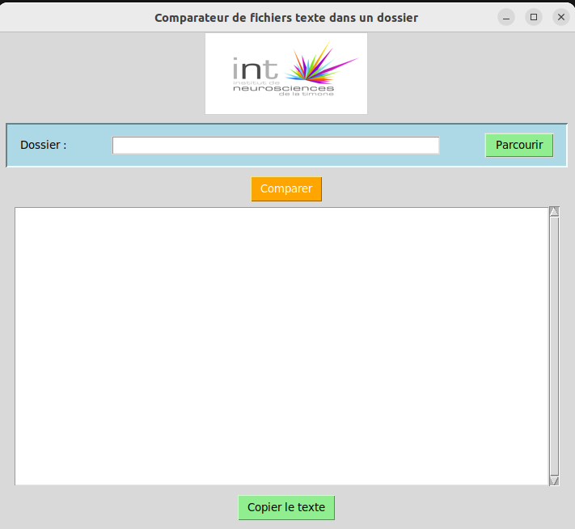

# Logiciel comparateur 
Logicielle comparateur des paquets installées sur un cluster HPC

## Ansible
Vous devez d’abord lancer le script ansible **get_installed_packages.yml** en tant que **root**, vous devez avoir la **version 8.2.0** de **Ansible** pour lancer la récupération des paquets installés. Et comme résultat vous aurez un dossier qui s’appelle **output** où il y a les différents fichiers . Txt

Il y a aussi le fichier **hosts** où l'on déclare les différentes machines sur lesquelles on veut lancer notre inventaire, pour récupérer les paquets, voilà un exemple 

```sh
[slurm]
niolon01 
niolon02 


[all:vars]
ansible_user=root
```
pour lancer le script **Ansible** il suffit de saisir la commande suivante: 
 
```sh
$ ansible-playbook -i host get_installed_packages.yml
```

## Python

pour lancer le logiciel python il faut avoir les 3 paquets python installés, **tkinter, Pillow et Pandas.** **Et la version Python 3.10.12**




vous cliquez par la suite sur le bouton **parcourir** pour choisir le dossier ou vous pouvez mettre le chemin du dossier directement dans l’input où il y a les fichiers **.txt** récupérer par Ansible, Ensuite cliquez sur le bouton **Comparer**, pour récupérer le résultat de comparaison, vous avez le choix faites copier le texte pour récupérer le résultat en cliquant sur le boutton **Copier le texte**, sinon vous aurez un fichier **Excel** qui contient deux feuilles une pour ***les paquets en commun***, et l’autre pour ***les paquets qui existent sur un nœud et n’existe pas sur les autres***.


